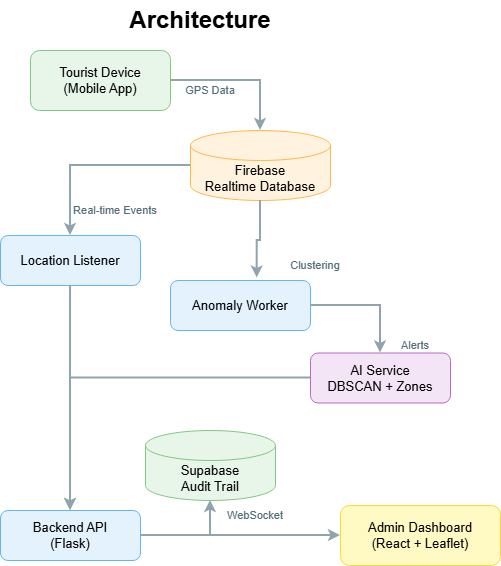

# T-MASS - Tourist Monitoring and Safety System


Real-time AI-powered tourist safety monitoring system using DBSCAN clustering and geospatial zone detection.

---

## Overview

T-MASS is an intelligent monitoring platform designed to enhance tourist safety at beaches and recreational areas. The system tracks tourists in real-time and uses AI to detect potentially dangerous situations before they become critical.


### The Problem

- Tourists wander into dangerous zones (deep water, restricted areas)
- Lifeguards cannot monitor 500+ tourists simultaneously  
- Emergency situations need instant detection
- Manual monitoring is inefficient and error-prone

### Our Solution

- Real-time GPS tracking of all tourists
- AI-powered anomaly detection using DBSCAN clustering
- Geospatial zone monitoring
- Instant alerts to admin dashboard
- Cryptographic audit trail for accountability

---

## Key Features

- Live tracking of 500+ tourists with 10-second update intervals
- DBSCAN clustering to identify isolated individuals
- Multi-zone safety monitoring (safe/restricted/danger)
- Four-level alert system (Normal/Info/Warning/Critical)
- Real-time admin dashboard with map visualization
- Emergency SOS button for tourists
- SHA-256 + HMAC cryptographic security

---

## Technology Stack

### Backend
- **Flask + SocketIO**: REST API and WebSocket server
- **FastAPI**: AI service for clustering and anomaly detection
- **Firebase Realtime Database**: Live location tracking
- **Supabase (PostgreSQL)**: Permanent audit trail
- **scikit-learn**: DBSCAN clustering algorithm
- **Shapely**: Geospatial zone detection

### Frontend
- **React 18**: User interface framework
- **Leaflet.js**: Interactive map visualization
- **Socket.IO Client**: Real-time updates
- **Vite**: Build tool

---

## System Architecture



### Data Flow
```
Tourist Device → Firebase Realtime DB
                      ↓
              Location Listener
                      ↓
              Anomaly Worker → AI Service (DBSCAN + Zones)
                      ↓
              Alert Generation
                      ↓
        Firebase + Supabase (Audit Trail)
                      ↓
              Admin Dashboard
```

### Component Breakdown

**AI Service (FastAPI)**
- DBSCAN clustering with Haversine distance
- Point-in-polygon zone detection
- Anomaly scoring algorithm

**Backend Workers**
- Location Listener: Monitors Firebase for real-time events
- Anomaly Worker: Analyzes all positions every 10 seconds

**Admin Dashboard**
- Live map with color-coded markers
- Real-time alert panel
- Tourist details modal
- Zone overlay visualization

---

## Installation

### Prerequisites

- Python 3.10+
- Node.js 18+
- Firebase account
- Supabase account

### Setup Steps

1. Clone repository
```bash
git clone https://github.com/YOUR_USERNAME/tmass-system.git
cd tmass-system
```

2. Create virtual environment
```bash
python -m venv venv
venv\Scripts\activate  # Windows
source venv/bin/activate  # Mac/Linux
```

3. Install dependencies
```bash
# AI Service
cd ai-service
pip install -r requirements.txt

# Backend
cd ../backend
pip install -r requirements.txt

# Frontend
cd ../frontend
npm install

# Simulation
cd ../simulation
pip install -r requirements.txt
```

4. Configure environment variables (see Configuration section below)

5. Setup databases
- Create Firebase Realtime Database
- Create Supabase project and run schema from `docs/supabase-schema.sql`

6. Run services (open 6 terminals)
```bash
# Terminal 1: AI Service
cd ai-service
python app.py

# Terminal 2: Backend
cd backend
python app.py

# Terminal 3: Location Listener
cd backend
python workers/location_listener.py

# Terminal 4: Anomaly Worker
cd backend
python workers/anomaly_worker.py

# Terminal 5: Frontend
cd frontend
npm run dev

# Terminal 6: Simulation
cd simulation
python data_generator.py
python simulation_runner.py fast
```

---

## Configuration

Create `.env` files with your credentials:

**backend/.env**
```env
FIREBASE_CREDS_PATH=firebase-creds.json
FIREBASE_DATABASE_URL=your-firebase-url
SUPABASE_URL=your-supabase-url
SUPABASE_KEY=your-supabase-key
AI_SERVICE_URL=http://localhost:8001
SECRET_KEY=your-secret-key
BACKEND_HOST=0.0.0.0
BACKEND_PORT=5000
ALLOWED_ORIGINS=http://localhost:5173
```

**frontend/.env**
```env
VITE_FIREBASE_API_KEY=your-api-key
VITE_FIREBASE_DATABASE_URL=your-firebase-url
VITE_FIREBASE_PROJECT_ID=your-project-id
VITE_FIREBASE_APP_ID=your-app-id
VITE_SUPABASE_URL=your-supabase-url
VITE_SUPABASE_ANON_KEY=your-supabase-key
VITE_BACKEND_URL=http://localhost:5000
```

---

## Usage

### Access Points

- **Tourist Registration**: http://localhost:5173
- **Admin Dashboard**: http://localhost:5173/admin
- **API Documentation**: http://localhost:8001/docs

### Demo Scenarios

**Quick Demo (24 seconds)**
```bash
cd simulation
python mr_x_demo.py
```

**Full Simulation (500 tourists)**
```bash
cd simulation
python simulation_runner.py fast
```

---

## Screenshots

### Admin Dashboard


### Live Map with Tourists


### Alert System


---

## Team Contributions

| Name | Role | Key Contributions |
|------|------|-------------------|
| **Yuvaraj** | AI/ML Engineer | DBSCAN implementation, simulation data generator, zone detection, AI service, Mr. X scenario |
| **Barath** | Backend Engineer | Flask API, Firebase integration, Supabase audit trail, cryptographic security, workers, WebSocket |
| **Bhava** | Frontend Developer | React dashboard, Leaflet maps, real-time hooks, alert panel, tourist registration, UI/UX |
| **Arun** | System Architect | System architecture, database schemas, security strategy, documentation, deployment configs |

### Contribution Statistics

- **Total Commits**: 345
- **Files Created**: 74
- **Lines of Code**: ~9,300
- **Development Time**: 5 weeks

---

## Future Enhancements

### Short-term (3-6 months)
- Native mobile apps (iOS/Android)
- Advanced ML models for predictive analytics
- Heatmaps and historical playback
- Weather integration

### Medium-term (6-12 months)
- Multi-location support
- Emergency services integration
- IoT wristbands for tourists
- Advanced analytics dashboard

### Long-term (1-2 years)
- AI-powered risk prediction
- Computer vision integration
- Multi-hazard monitoring
- Gamification for safety education

### Scalability Roadmap

**Current**: 500 tourists per location, 10-second updates

**Year 1**: Scale to 5,000 tourists
- Redis caching
- Kafka event streaming
- Kubernetes deployment

**Year 2**: Scale to 50,000 tourists
- Microservices architecture
- Distributed processing
- Multi-region deployment

**Year 3**: Scale to 500,000+ tourists
- Cloud-native infrastructure
- Auto-scaling
- Machine learning pipeline

---

## License

MIT License - See LICENSE file for details

---


**Team**:
- Arun - System Architect
- Yuvaraj - AI/ML Engineer
- Barath - Backend Engineer  
- Bhava - Frontend Developer

---

Built by Team Hakuna Matata
